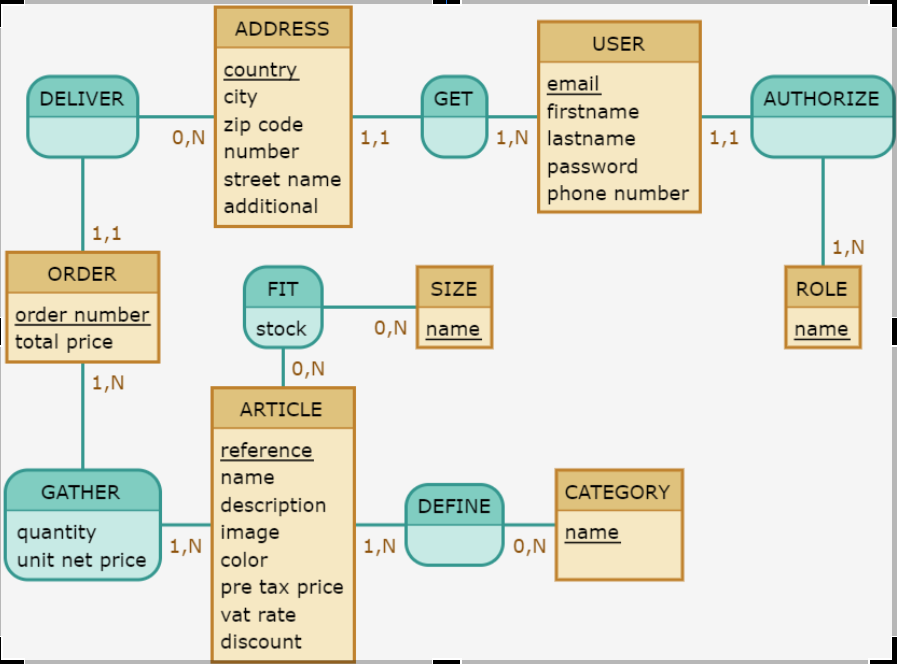

# Projet e-commerce

## API - SWITCH 
## Stack

- Node js 10+
  - Express
- PostgreSQL 11+
- Cors
- JWT Token
- Sanitizer
- Bcrypt
- Stripe
- Sqitch (migration)

## MCD

 
## MLD

## Pour utiliser l'API
 -Clone the repository
 - install Node.js, PostgreSQL and sqitch.  
 https://nodejs.org/fr/download/  
 https://www.postgresql.org/download/  
 https://sqitch.org/download/      
 - create an .env file based on the .env.example file  
- create a PostgreSQL switch database
   
### Then run the following commands in CLI: 
 - npm i  
 - sqitch deploy db:pg:switch 
 - node index.js
 
You can now use the API.
 If you have the VSC Client Rest extension you can also use the table.http file to try out the routes.

